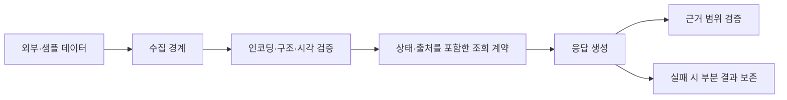

# ForeShield — 데이터 경계와 AI 응답 신뢰성 검증

기후재난 정보 조회와 대응 훈련을 지원하는 팀 서비스에서 수행한 데이터 검증·응답 신뢰성 작업을
공개 가능한 범위로 재구성한 포트폴리오 저장소입니다.

> 이 저장소는 비공개 팀 서비스의 원본 코드가 아닙니다. 실제 소스, 내부 경로, 커밋 식별자,
> 운영 데이터와 클라우드 설정을 포함하지 않습니다. `examples/`는 합성 입력만 사용하는 독립 예제입니다.

## 프로젝트와 개인 기여 구분

| 구분 | 내용 |
|---|---|
| 팀 프로젝트 | 기후재난 위험도·예보·특보 조회, 자연어 질의, 대응 훈련을 하나의 서비스로 구성 |
| 개인 기여 | 데이터 조회 Tool과 입력·출력 계약, 수집 파일 검증, 훈련 세션, 답변 근거 검증 보강, 제품 도움말 표현 처리, 대화 실패 복구 |
| 공개 예제 | 엄격 JSON 경계, 순서를 보존하는 중복 제거 |
| 공개하지 않는 것 | 팀 원본 코드, 다른 팀원의 코드, 내부 이력·경로, 사용자 대화, 실제 재난 데이터, 자격정보 |

## 담당 영역



### 1. 데이터는 값만 전달하지 않도록 설계

조회 결과에 값과 함께 상태, 출처, 오류 정보를 전달하도록 경계를 구성했습니다.
미발행·미지원·손상·오래된 데이터를 같은 빈 값으로 취급하지 않고 호출자가 구분할 수 있게 하는 것이 목적이었습니다.

광역 예보처럼 집계 의미가 합의되지 않은 값은 임의로 합성하지 않았고, 원문 항목을 포함관계로 조회할 수 있는
경우에만 지원했습니다. 데이터가 있다는 이유만으로 의미가 다른 계산을 추가하지 않는 판단을 중요하게 봤습니다.

### 2. 파서가 허용하는 JSON과 서비스가 허용하는 JSON을 분리

일반 JSON 파서가 읽을 수 있어도 다음 단계에서 해석이 달라질 수 있는 입력을 경계에서 거부했습니다.

- UTF-8 선행 디코딩
- 중복 object key 거부
- `NaN`, `Infinity`와 overflow로 생긴 비유한 수치 거부
- 합성 입력을 이용한 정상·실패 경계 테스트

[`examples/strict_json.py`](examples/strict_json.py)는 이 판단을 표준 라이브러리만으로 재구성한 예제입니다.

### 3. 순서와 탐색 비용을 함께 고려한 중복 제거

표현 후보의 표시 순서는 리스트로 보존하면서, 이미 본 값인지는 집합으로 검사하도록 분리했습니다.
서로 다른 도움말 항목 사이의 같은 문장을 전역에서 제거하지 않도록 생성 단위별로 적용합니다.

[`examples/pattern_dedup.py`](examples/pattern_dedup.py)는 실제 도움말 생성기가 아니라 이 자료구조 선택만 보여줍니다.

### 4. 응답 실패도 사용자에게 보인 상태와 맞추기

기존 응답 생성 흐름에서 수치가 같은 지역·시간·사건의 근거인지 확인하는 범위를 보강했습니다.
스트림 도중 오류가 나면 이미 전달된 부분 답변과 오류 상태를 함께 보존하고, 삭제 중 늦게 도착한 비동기 결과가
새 화면을 덮어쓰지 않도록 상태를 다시 확인했습니다.

이 설명은 담당한 변경 범위이며, Agent·SSE·데이터베이스 구조 전체를 처음부터 설계했다는 뜻이 아닙니다.

## 실행

Python 3.11 이상과 표준 라이브러리만 필요합니다.

```bash
python -m unittest discover -s tests -v
python -m examples.strict_json
python -m examples.pattern_dedup
```

## 저장소 구조

```text
.
├── examples/
│   ├── strict_json.py
│   └── pattern_dedup.py
├── tests/
│   └── test_examples.py
├── .github/workflows/ci.yml
├── LICENSE
└── README.md
```

## 검증 범위와 한계

- 공개 예제의 테스트는 비공개 팀 서비스의 통합 테스트를 대신하지 않습니다.
- 실제 Azure·데이터베이스·LLM 연결과 배포 상태를 이 저장소에서 재현할 수 없습니다.
- 팀 프로젝트 전체 기능과 위 두 예제의 구현을 개인 성과로 동일시하지 않습니다.
- 원본 저장소 증적은 공개하지 않으며, 열람 권한이 허용되는 상황에서만 별도로 설명할 수 있습니다.

## 라이선스

이 저장소에서 공개용으로 재구성한 예제와 문서는 [MIT License](LICENSE)로 제공합니다.
비공개 팀 프로젝트의 원본 코드·데이터에는 이 라이선스가 적용되지 않습니다.
